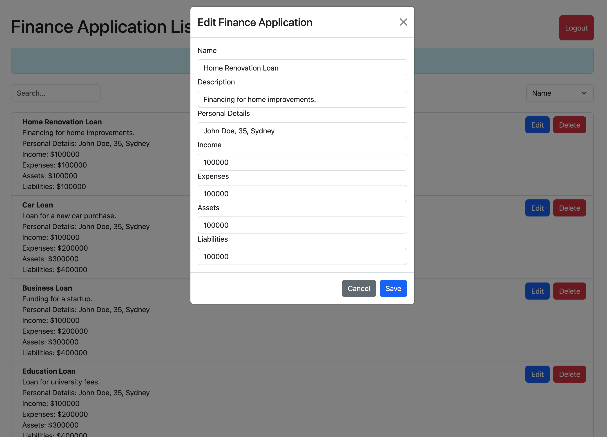

# Finance Application Management

A React-based web application for managing finance applications. The app provides functionalities to add, edit, delete, and filter finance applications, as well as user authentication (login and registration).

## Table of Contents

- [Overview](#overview)
- [Features](#features)
- [Technologies Used](#technologies-used)
- [Installation](#installation)
- [Running the Application](#running-the-application)
- [Running Tests](#running-tests)
- [Deployment](#deployment)
- [Environment Variables](#environment-variables)
- [Generating and Viewing Documentation](#generating-and-viewing-documentation)
- [Screenshots](#screenshots)

## Overview

This application is designed to help users manage finance applications efficiently. It supports various operations, such as adding new applications, editing existing ones, and filtering the list of applications based on different criteria. User authentication is implemented to ensure data security and integrity.

## Features

- User Authentication (Login, Logout, Registration)
- Add, Edit, Delete Finance Applications
- Search and Filter Applications
- Pagination for Application List
- Responsive and User-Friendly Interface

## Technologies Used

- **Frontend**: React.js, Redux, React Router, React Bootstrap
- **State Management**: Redux Toolkit
- **Styling**: Bootstrap, CSS
- **API**: Axios
- **Testing**: Jest, React Testing Library

## Installation

### Prerequisites

Ensure you have the following installed:

- **Node.js**
- **npm**: Installed with Node.js

### Steps

1. **Clone the Repository**:

   ```bash
   git clone <repository-url>
   cd <repository-directory>
   ```

2. **Install Dependencies**:

   ```bash
   npm install
   ```

3. **Create Environment Variables**:
   Create a .env file in the root of your project with the following content:

   ```bash
   REACT_APP_BACKEND_API_URL=<your-backend-api-url>
   ```

   Replace <your-backend-api-url> with the actual URL of your backend API.

## Running the Application

To run the application in development mode:

```bash
npm start
```

This will start the development server, and you can access the app at http://localhost:3000.

## Running Tests

To run tests for the application:

```bash
npm test
```

This will execute all the test files using Jest.

## Deployment

### Build the Application

To create a production build:

```bash
npm run build
```

This will generate a build directory containing the optimized production build.

### Deploy the Application

Deploy the contents of the build directory to any static file server such as: Amazon

## Environment Variables

REACT_APP_BACKEND_API_URL: The base URL for your backend API.

## Generating and Viewing Documentation

This project uses JSDoc to generate code documentation. You can generate the documentation using the following command:

```bash
npm run doc
```

After running this command, the documentation will be generated in the docs directory of the project. You can view the documentation by opening the following file in a browser:

Open docs/index.html to view the documentation homepage.

## Screenshots

Here are some screenshots of the applications:

### Login Page


### Register Page


### Application List Page


### Add Application Page


### Update Application Page


